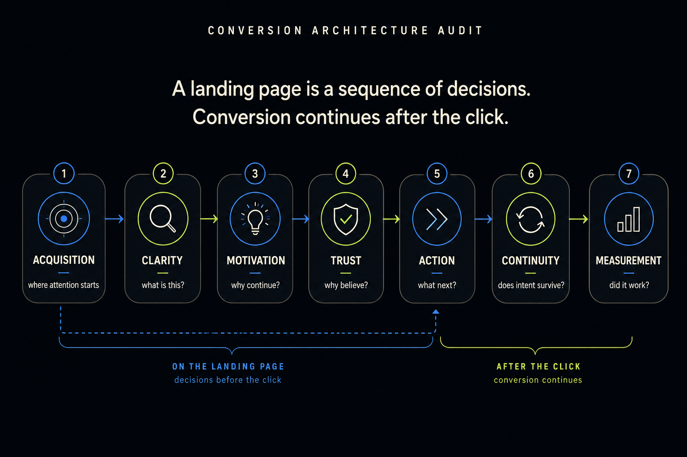

# Conversion Architecture Audit

An open-source design engineering framework for auditing how landing pages move people from first impression to meaningful action.

Audit narrative structure, information hierarchy, value proposition, visual hierarchy, CTA progression, trust, friction, post-click continuity, analytics, and attribution as one connected system. Designed for humans and compatible AI agents.

> A landing page is a sequence of decisions. Every section should answer the next question in the visitor’s mind.

## Install

Install with the Agent Skills CLI:

```bash
npx skills add dansophi/conversion-architecture-audit
```

Inspect available skills without installing:

```bash
npx skills add dansophi/conversion-architecture-audit --list
```

Install specifically for Codex:

```bash
npx skills add dansophi/conversion-architecture-audit --agent codex
```

Install specifically for Claude Code:

```bash
npx skills add dansophi/conversion-architecture-audit --agent claude-code
```

Install specifically for Cursor:

```bash
npx skills add dansophi/conversion-architecture-audit --agent cursor
```

The commands above were verified against the current CLI help. Agent integrations can change as the CLI evolves; use `npx skills add --help` for the current list.

## Quick start

```text
Run a Conversion Architecture Audit on this landing page:
https://example.com

Primary conversion: Start free trial
Audience: Small product teams
Primary acquisition: Organic search and paid social

Inspect the complete page and the experience after the primary CTA.
Prioritize structural conversion problems before optimizations.
```



## What it is

Conversion Architecture Audit is an executable design engineering methodology for reconstructing the decision sequence a page asks a visitor to make.

It can be used for SaaS, ecommerce, marketplaces, product launches, waitlists, service businesses, campaign pages, pricing pages, signup flows, and lead generation. It is not a universal landing-page template: the right sequence depends on the audience, acquisition source, visitor awareness, proposition, conversion goal, commitment level, and product complexity.

## Why this exists

Landing page advice often isolates tactics: make the button bigger, shorten the page, add proof, move pricing, or remove fields. Those changes may be useful, but they do not explain whether the page is telling the right story at the right time.

This framework treats copy, layout, interaction, handoff, and measurement as one connected system. A CTA click is not automatically a conversion if the next step loses the visitor’s original intent.

## What it audits

- Narrative structure and section ordering
- Value proposition and offer framing
- Information architecture and visual hierarchy
- CTA architecture and commitment levels
- Trust, evidence, and credibility at moments of skepticism
- Accidental friction and responsive/mobile behavior
- Post-click continuity through signup, checkout, onboarding, and activation
- Analytics, attribution, baselines, and meaningful outcomes

## The decision-sequence model

```text
What is this?
      ↓
Why should I care?
      ↓
Is this relevant to me?
      ↓
How does it work?
      ↓
Why should I trust it?
      ↓
What do I get?
      ↓
What is required from me?
      ↓
What should I do next?
```

An audit reconstructs the likely questions for a real visitor, then compares that sequence with the actual page. It does not assume that every page needs the same sections or order.

## A short before/after example

**Current flow:** Hero → feature grid → integrations → technical details → pricing → testimonials → CTA

**Recommended flow:** Hero → core outcome → how it works → relevant proof → capabilities → integrations → pricing → FAQ → CTA

The change is not “testimonials always go above features.” It is a hypothesis that visitors need the outcome, mechanism, and relevant evidence before evaluating implementation detail or committing.

## Post-click continuity

The framework follows the broader journey:

```text
Acquisition → Landing Page → Signup / Checkout / Lead Capture
           → Onboarding → Activation → Conversion → Retention
```

If a CTA promises “Start free trial,” the destination should continue that intent. A generic redirect that makes someone rediscover what they came to do is a conversion problem, even when the landing-page click rate looks healthy.

## Audit output

A completed audit produces:

1. **Diagnosis** — the most important problems and their likely causes.
2. **Recommended Flow** — current versus recommended sequence, with reasons for significant moves.
3. **Section-Level Review** — `Keep`, `Problem`, `Change`, and `Why` for each important section.
4. **Conversion Path** — the intended journey from acquisition through successful conversion, including the post-click handoff.
5. **Measurement Plan** — primary and secondary conversions, funnel events, attribution, baselines, and success criteria.

See the [fictional example audit](./examples/example-audit.md) for a compact demonstration.

## Priority system

- **P0 — Blocking:** broken actions, contradictory pricing, placeholder content, broken responsive layouts, or trust-damaging defects.
- **P1 — High Impact:** structural changes to value proposition, page order, CTA hierarchy, or post-click continuity.
- **P2 — Optimization:** improvements to copy density, card layout, visual emphasis, or proof placement after fundamentals are sound.
- **P3 — Experiment:** hypotheses such as alternate heroes, sticky CTAs, shorter forms, or pricing variants that need validation.

Fix fundamentals before experimenting. Distinguish observed structural problems from ideas worth testing.

## What it intentionally does not do

It does not automatically recommend bigger buttons, more CTAs, shorter pages, testimonials, countdown timers, sticky CTAs, popups, fewer form fields, pricing above the fold, artificial urgency, or competitor layouts. Any such recommendation must be grounded in the visitor, proposition, context, and evidence.

It rejects manufactured scarcity, fake social proof, fabricated reviews, misleading pricing anchors, fake demand, deceptive urgency, and other dark patterns.

## Repository structure

```text
conversion-architecture-audit/
├── README.md
├── skills/
│   └── conversion-architecture-audit/
│       └── SKILL.md
├── examples/
│   └── example-audit.md
├── assets/
│   └── preview.png
├── LICENSE
└── .gitignore
```

The nested `SKILL.md` is the installable Agent Skill. The root README is the human-facing project page.

## Contributing

Contributions are welcome: improve the methodology, add vendor-neutral examples, or document edge cases that sharpen the distinction between structural diagnosis and experimentation. Keep recommendations evidence-led and grounded in the visitor’s decision sequence.

## License

Released under the [MIT License](./LICENSE).
